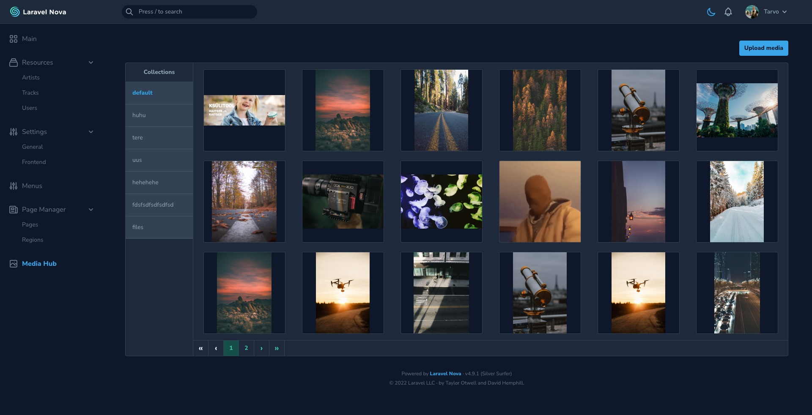
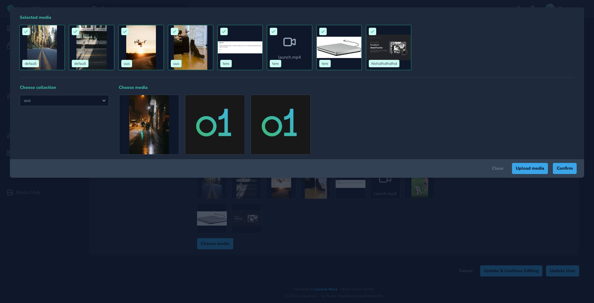

# Nova Media Hub

[](https://packagist.org/packages/outl1ne/nova-media-hub)
[](https://packagist.org/packages/outl1ne/nova-media-hub)

This [Laravel Nova](https://nova.laravel.com) package allows you to manage media and media fields.

## Requirements

- `php: >=8.0`
- `laravel/nova: ^4.0`

## Features

- Media Hub UI in separate view
- Media Hub field for selecting single/multiple media
- Image optimization and multiple conversions support
- File naming and path making customization
- Dark mode support
- A lot configuration options
  - See [the configuration file](config/nova-media-hub.php).

## Screenshots





## Installation

Install the package in a Laravel Nova project via Composer and run migrations:

```bash
# Install nova-media-hub
composer require outl1ne/nova-media-hub

# Run migrations
php artisan migrate
```

Register the tool with Nova in the `tools()` method of the `NovaServiceProvider`:

```php
// in app/Providers/NovaServiceProvider.php

public function tools()
{
    return [
        // ...
        \Outl1ne\NovaMediaHub\MediaHub::make()
        // You can choose to hide the Tool from the sidebar
          ->hideFromMenu()

          // Optionally add additional fields to Media items
          ->withCustomFields(
            ['copyright' => __('Copyright')],
            overwrite: false
          )
    ];
}
```

## Usage

### Fields

This package provides a field `MediaHubField` which allows you to select media. This saves the media as a JSON array into the database.

Example usage:

```php
use Outl1ne\NovaMediaHub\Nova\Fields\MediaHubField;

// ...

MediaHubField::make('Media', 'media')
  ->defaultCollection('products') // Define the default collection the "Choose media" modal shows
  ->multiple(), // Define whether multiple media can be selected
```

### Casting

The media column of models can be automatically cast as a Collection of Media models:

```php
class Product extends Model
{
    protected $casts = [
        'media' => \Outl1ne\NovaMediaHub\Casts\MediaCast::class,
    ];
}
```

```php
    $cover = Product::first()->media->first();

    // ...

    $urls = Product::first()->media->pluck('url');

    // ...

    $collection = Product::first()->media->where('collection_name', 'Details');
```

### Configure

The config file can be published using the following command:

```bash
php artisan vendor:publish --provider="Outl1ne\NovaMediaHub\MediaHubServiceProvider" --tag="config"
```

### Custom optimizer chain

You can define a custom optimizer chain or add items to it like so:

```php
// in app/Providers/AppServiceProvided.php

public function register() {
  // ...

  // https://github.com/spatie/image-optimizer#creating-your-own-optimization-chains
  \Outl1ne\NovaMediaHub\MediaHub::withOptimizerChain(
    (new OptimizerChain)
      ->addOptimizer(new Jpegoptim([
        '--strip-all',
        '--all-progressive',
      ]))
      ->addOptimizer(new Pngquant([
        '--force',
      ]))
  );
}

```

## Localization

The translation file(s) can be published by using the following command:

```bash
php artisan vendor:publish --provider="Outl1ne\NovaMediaHub\MediaHubServiceProvider" --tag="translations"
```

## Credits

- [Tarvo Reinpalu](https://github.com/Tarpsvo)

## License

Nova Media Hub is open-sourced software licensed under the [MIT license](LICENSE.md).
